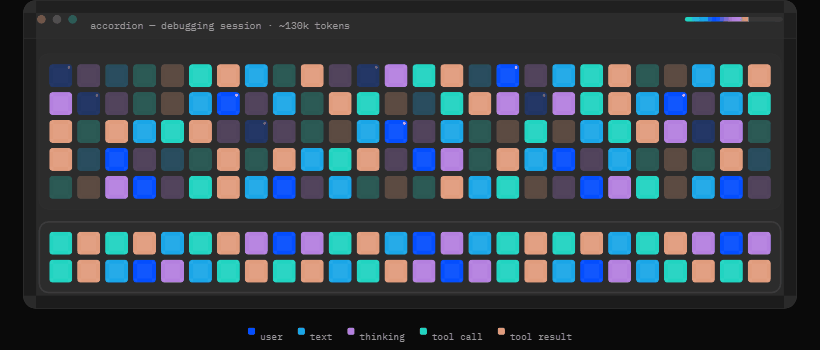

<div align="center">

<picture>
  <source media="(prefers-color-scheme: dark)" srcset="docs/assets/logo-lockup-white.png">
  
</picture>

### /compact is the naive solution, Accordion is the intelligent one.

**See everything your AI agent holds in context — and fold it like an accordion instead.**



<sub>Your whole context window split in 2 sections. The lower section represents your agents most recent context and is protected against any interference</sub>
</div>

---

Accordion is a [pi](https://github.com/earendil-works/pi) extension that shows you
your agent's entire context window at a glance and lets you manage it manually or with intelligence through a conductor.

<div align="center">

<a href="docs/assets/accordion-demo.mp4"></a>

</div>

## Why it's different

#### 1. No blocking calls for compaction 
> your context window is automatically managed for you in the background, keeping you below your limit

#### 2. longer more useful sessions
> The relevance of each block is ranked so we only fold bloat, and keep whats important. 

#### 3. Cheaper inference costs
> Accordion keeps your context window lean, with cache optimizations in mind.

Every long-running agent hits the same wall: the context fills up, and something has to
go. Today's answers are dumb and dumber:

- **Compaction** blasts your whole history into one lossy summary — slow, destructive,
  all-or-nothing.
- **Sliding windows** just drop the oldest tokens — the agent simply forgets.

| | Sliding window | `/compact` | skills & memory | 🪗 Accordion |
|---|:---:|:---:|:---:|:---:|
| Keeps old context usable | ❌ | ⚠️ lossy | ⚠️ if retrieved | ✅ |
| **Reversible** to full detail | ❌ | ❌ | ❌ | ✅ |
| No mid-task stall | ✅ | ❌ | ✅ | ✅ |
| Per-section, not all-or-nothing | ❌ | ❌ | ⚠️ | ✅ |
| You can see and steer it | ❌ | ❌ | ❌ | ✅ |
| No extra infra (no vector DB) | ✅ | ✅ | ❌ | ✅ |

## The proof — early, but pointed

Accordion ships with a catalog of interchangeable **Conductors**. The strongest so far,
**[Thermocline](conductors/thermocline/)**, scores each block relevance to the most recent context using the attention from a 500M parameter model as a proxy.

In a test run on **SlopCodeBench** (a long-horizon coding benchmark), Thermocline at a
100k-token budget outperformed naive compaction with the same constrained context budget. Both used deepseekV4Pro.

| Conductor | Context Budget | Score | Checkpoints reached |
|---|:---:|:---:|:---:|
| **Thermocline** | 100k | **83.3%** | 5 / 6 |
| naive compaction | 100k | 33.3% | 2 / 6 |

> ⚠️ **Read this as a signal, not a guarantee.** It's a single hackathon-scale run on a
> subset of the problems — not a published benchmark. Broader, repeatable evaluation is on the roadmap.

## How it works

The **context Map** is the whole window at a glance: one square per block, sized by token
weight (a dice face, 1–6), colored by kind — **user** messages, **assistant** responses,
**thinking**, **tool calls**, and **tool results** each get their own hue. Bright = live;
recessed and hatched = folded.

Three hands share those controls:

- **You** — fold, unfold, pin, and peek by hand. Your overrides always win.
- **The agent** — reaches back to unfold or pin context it needs mid-task, or **recall**
  a folded block as a tool result (like `read_file`) without changing what's standing in
  context.
- **The Conductor** — an automatic strategy that, between turns, folds what's gone cold
  and unfolds what's becoming relevant. Collaborative by default; an *exclusive*
  conductor you approve can take over specific controls, and **detach** is always your
  kill switch.

Every block is **Full**, **Folded** (shown as a short tagged summary), or **Pinned**
(locked open).

<div align="center">

<br><sub>Folded blocks are shown with dull colors </sub>
</div>

Folds nest: cold turns fold into groups, groups into bigger groups, so a session of
thousands of turns stays small enough to fit and complete enough to recover. And the
recent past is always safe — the most recent ~20k tokens are a protected working tail the
agent reasons over at full fidelity (the thick-bordered box below the fold line).

→ Capability matrix, full walkthrough, and the deep spec: **[VISION.md](VISION.md)**

## What works today

- ✅ Desktop app (Tauri + SvelteKit): the Map view, token budget, inspector, protected
  working tail.
- ✅ Live link to a running pi session, with auto-discovery.
- ✅ Opt-in live steering — apply your fold plan to what the agent is shown.
- ✅ Reversible, provider-safe folding with deterministic `{#code FOLDED}` digests the
  agent can ask to unfold.
- ✅ Involvement locks — exclusive conductors, the consent gate, freeze-on-detach, and
  agent `recall`.
- ✅ The Conductor — automatic fold/unfold between turns, based on context.
- ✅ LLM-generated summaries, computed once and cached.
- ✅ Read-only browsing of saved Claude Code transcripts.

Honest about what's **not** there yet: no agent-driven pinning, no hierarchical (nested)
groups, no replay. That's the build ahead.

## Roadmap

- [x] Core fold/unfold engine — reversible, tool-pair safe
- [x] The separate window — desktop app: Map view, budget, inspector
- [x] Live link to pi + auto-discovery, opt-in steering
- [x] Agent-driven unfold + `recall`, involvement locks
- [x] LLM-generated summaries, computed once and cached
- [x] The Conductor — automatic fold/unfold between turns
- [ ] Hierarchical folding for million-turn sessions
- [ ] Agent-driven pin
- [ ] Replay — scrub how context evolved across a session
- [ ] Better conductors — research, develop, and test stronger context strategies
- [ ] Expand accordion beyond pi

## Quick start

### Part 1 — Browser (no Rust, no desktop app)

```bash
pi install npm:@a-fig/accordion
```
restart pi if it is already running, then inside of pi run:                                      
 ```bash
    /accordion                                                                       
 ```
That's it, assuming you have [pi](https://github.com/earendil-works/pi)

---

### Part 2 — Desktop app (Optional - full feature set)

The desktop app adds **multi-session discovery** (switch between running pi sessions from
a sidebar), conductors that require local model resources, and the `/accordion` command
that foregrounds the right session automatically. It requires Node 20+ and Rust.

**Prerequisites:** install [Node 20 LTS](https://nodejs.org) and
[Rust via rustup](https://rustup.rs), then follow the one-time platform setup at
**https://v2.tauri.app/start/prerequisites/** (WebView2 + MSVC on Windows, Xcode CLT on
macOS).

**1. Clone and install:**

```bash
git clone https://github.com/a-Fig/accordion.git
cd accordion/app && npm install
```

**2. Register the extension with pi** — add to `~/.pi/agent/settings.json`:

```json
{ "extensions": ["<absolute-path-to-repo>/extension/accordion.ts"] }
```

**3. Launch the desktop app:**

```bash
npm run tauri dev   # opens the native window; hot-reloads on save
```

**4. Run pi in any project.** It appears in Accordion's **Sessions** sidebar within ~1s.
Click it (or run `/accordion` in that terminal) and its context populates live.

## Contributing

An experiment in context engineering — contributions, ideas, and benchmarks welcome.
Setup, the quality gate, and platform gotchas are in **[CONTRIBUTING.md](CONTRIBUTING.md)**.

Our main frontier right now is **better conductors**: researching which context actually
matters, developing stronger strategies, and testing them against real sessions. We're not
chasing a long tail of mediocre ones — the goal is one to three conductors that genuinely
hold up. A conductor is a single class with one method — `conduct(view) → Command[]` — and
one registration line to appear in the app. Strategies can range from simple oldest-first
folding to scoring each block's relevance with a small model. If you have a theory about
what an agent should keep and what it can let go, that's the surface to prove it — and the
place where outside help is most valuable right now.

---

**The north star: your agent's memory should be something you can see and steer — not a
black box that silently forgets.**

<div align="center">

🏆 &nbsp;Built at the **AI Hackathon 2026 @ UC Berkeley** — a winning project.

<sub>Tyler Darisme &nbsp;·&nbsp; Aaditya Desai &nbsp;·&nbsp; Sheel Shah &nbsp;·&nbsp; Thy Tang</sub>

🪗

</div>
